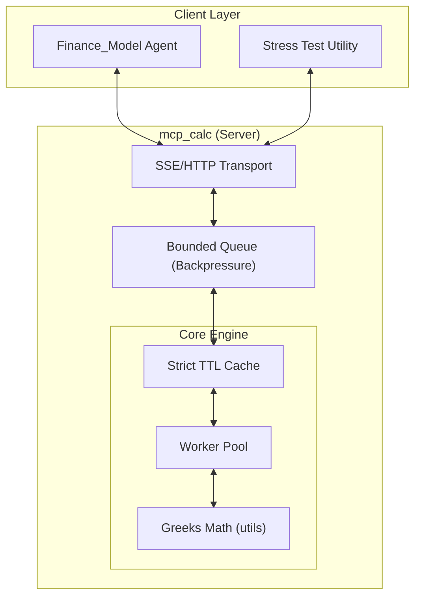

# Options Greek Engine (MCP Server)

A high-performance Model Context Protocol (MCP) server for fetching option chains and calculating Black-Scholes Greeks. Designed with **low-latency determinism** and **resilient concurrency** at its core.

## Key Features & Architecture

This server is built to handle high-load scenarios while maintaining ultra-low response times:

*   **Modular Architecture**: Clean separation of concerns between math logic (`utils/greeks.py`), data fetching (`utils/data_engine.py`), and the service layer (`main.py`).
*   **Strict TTL Caching**: Prioritizes data freshness for trading decisions. Valid data is served instantly from memory (TTL: 60s), while expired requests trigger a fresh fetch to ensure zero-stale-data risk.
*   **Asynchronous Backpressure Pipeline**: Uses a bounded `asyncio.Queue` (depth: 5) to ensure the system remains stable and responsive even under extreme burst traffic.
*   **Load Shedding**: Implements a "Drop Newest" policy to protect deterministic performance for existing requests when at capacity.

### Architecture Diagram



## Performance
*Benchmarks measured on local hardware.*

| Metric | Pre-Optimization | Post-Optimization (Cache Hit) | Improvement |
| :--- | :--- | :--- | :--- |
| `get_option_data` | **126 ms** | **107 µs** | **~1,100x** |
| Response Variance | High (Network) | **Ultra-Low (Deterministic)** | **Stable** |

## Available Tools

- `get_option_data`: Fetch S, K, T, r, and σ with intelligent defaults.
- `calculate_delta`: Calculate Option Delta (Δ).
- `calculate_gamma`: Calculate Option Gamma (Γ).
- `calculate_theta`: Calculate Option Theta (Θ).
- `calculate_vega`: Calculate Option Vega (ν).
- `calculate_rho`: Calculate Option Rho (ρ).

## Usage

1. **Install dependencies**:
   ```bash
   pip install -r requirements.txt
   ```
2. **Run the server**:
   ```bash
   python main.py
   ```

For detailed metrics and methodology, see [benchmarks/BENCHMARKS.md](benchmarks/BENCHMARKS.md).

